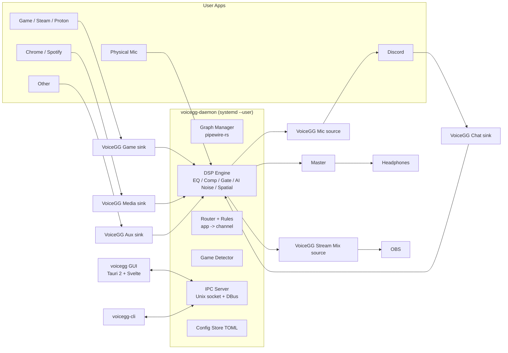

# VoiceGG — Implementation Plan (for Claude Code)

> A free, open-source (GPL-3.0) SteelSeries **Sonar** alternative for **Arch-based Linux** (Arch, EndeavourOS, CachyOS, Manjaro, Garuda…) — works on **Hyprland**, Sway, KDE, GNOME.
> Written in **Rust**. Same interface and concept as Sonar — but faster, lighter, more customizable, and 100% local/private.

---

## 0. Rules for the AI implementing this (READ FIRST)

1. **Privacy / public repo hygiene — MANDATORY**
   - NEVER commit or print personal info: usernames, home paths (`/home/<user>`), hostnames, emails, IPs, tokens, machine IDs, device serials.
   - Use `$XDG_CONFIG_HOME`, `$XDG_RUNTIME_DIR`, `dirs` crate — never hardcoded paths.
   - Git commits must use a generic author unless the maintainer configures their own. Don't read `~/.gitconfig`, SSH keys, or browser data.
   - No telemetry, no analytics, no network calls at runtime (except optional, opt-in "check for updates" against GitHub releases — off by default).
   - Logs must not contain device serials or full paths; redact with `~`.
   - Add a `.gitignore` covering `target/`, `node_modules/`, `.env*`, `*.log`, `dist/`, editor dirs.
2. Work phase by phase (Section 10). Each phase must compile, pass `cargo clippy -- -D warnings`, `cargo fmt --check`, and tests before moving on.
3. Never run anything as root. Never modify system files (`/etc`, `/usr`). Only user-level PipeWire config.
4. No `unsafe` outside the thin FFI layer; every `unsafe` block gets a `// SAFETY:` comment.
5. The real-time audio thread must **never allocate, lock, log, or block**.
6. Read `CLAUDE.md` at the repo root before every session; it repeats these rules.

### 0.1 Skills to use (load the skill before working on that area)

| Skill | Use it for |
|---|---|
| `sharp-edges` | Phases 1–4, 7–9: RT audio thread, PipeWire reconnects, hot-plug, race conditions, denormals |
| `secure-coding` | Phase 3 IPC socket, Tauri capabilities/CSP, preset/theme import validation, systemd hardening |
| `systematic-debugging` | Any xrun, crackle, no-sound, routing bug — find the root cause, add a regression test |
| `frontend-design` + `ui-styling` | Phases 5–6: Sonar-style Mixer, EQ graph, preset browser |
| `design-tokens` / `design-system` | Phase 11: theme tokens, per-channel accent colors, theme JSON |
| `accessibility` | All GUI work: keyboard faders, ARIA, contrast in every theme |
| `web-performance` | Level meters / spectrum at 60 fps without jank, GUI startup time |
| `webapp-testing` | Vitest + Playwright (`tauri-driver`) tests |
| `static-analysis` | CI: clippy pedantic, cargo-deny, Semgrep rules |
| `code-review-rubric` | Self-review at the end of **every** phase before marking it done |
| `ask-questions-if-underspecified` | If a requirement is unclear, ask the maintainer instead of guessing |

### 0.2 Linux-specific pitfalls (from review — must handle)

- **WirePlumber conflicts**: WirePlumber's `restore-stream` also remembers app targets and can move streams back. Route via PipeWire metadata `target.object` (as `pavucontrol`/`wpctl` do), and set our rules so they win; never fight WirePlumber in a loop. Test with WirePlumber 0.5+ (Lua → SPA-JSON config).
- **App identity**: Discord, Chrome, Spotify, VS Code are often all Electron/Chromium. Identify apps by `application.process.binary` + `application.name` + parent-process name, and fall back to `node.name`. Firefox/Chrome create a new stream per tab — rules must apply to new streams instantly (no audio blip in the wrong channel).
- **Proton/Wine games** show up as `wine64-preloader` or a generic name — use the game exe from `/proc/<pid>/cmdline` and the `SteamAppId` env var (read only for processes owned by the same user).
- **Bluetooth headsets**: switching to HFP (mic mode) drops quality to 16 kHz; warn the user in the UI, and handle the device's rate changing at runtime.
- **Sample-rate mismatch**: never force the global rate; follow the graph, and resample only inside the RNNoise block.
- **Denormals**: enable flush-to-zero/denormals-are-zero on the RT thread (x86 MXCSR) to avoid CPU spikes when the sound goes silent.
- **Crash safety**: if the daemon crashes, apps must not go silent forever — a systemd `Restart=on-failure`, and on startup clean up stale VoiceGG nodes. Provide `voicegg ctl panic` to restore the original defaults.
- **NVIDIA + WebKitGTK**: auto-set `WEBKIT_DISABLE_DMABUF_RENDERER=1` when an NVIDIA GPU is detected and the user hasn't overridden it.
- **Valorant** cannot run on Linux (Vanguard anti-cheat). Keep the preset as a headphone tuning only; don't put Valorant first in the marketing.
- **Trademarks**: never use "SteelSeries", "Sonar", "GG" logos, or their assets. Say "inspired by" in the README only.

---

## 1. Goals

| Goal | Target |
|---|---|
| Feature parity with Sonar | Mixer, Game/Chat/Media/Aux/Mic tabs, presets, favorites, ChatMix, Streamer mode, ClearCast-style AI noise |
| Better than Sonar | Lower latency, <1% CPU idle, daemon <30 MB RAM, GUI <150 MB (GUI exits fully when closed to tray), full color theming, auto game detection, AutoEQ-ready, CLI/DBus, Hyprland hotkeys |
| Safe | Memory-safe Rust, sandboxed Tauri, no network, no root, signed releases |
| No audio problems | Graceful device hot-plug, sample-rate following, xrun-free DSP, restores user's original routing on exit/uninstall |

Non-goals (v1): Windows/macOS, PulseAudio-only systems, JACK, Flatpak, headset hardware (HID/ChatMix dial) control — software only.

---

## 2. Architecture



### Components (Cargo workspace)

```
voicegg/
├── Cargo.toml                  # workspace
├── crates/
│   ├── voicegg-core/           # shared types: Channel, Preset, EqBand, Theme, IPC messages (serde)
│   ├── voicegg-dsp/            # pure DSP, no PipeWire dependency, fully unit-testable
│   ├── voicegg-pw/             # PipeWire graph: virtual sinks/sources, links, stream metadata
│   ├── voicegg-daemon/         # binary: owns graph + DSP + router + game detector + IPC
│   ├── voicegg-cli/            # binary: `voicegg ctl ...` for hotkeys/scripts
│   └── voicegg-ipc/            # protocol + client lib (used by GUI & CLI)
├── app/                        # Tauri 2 GUI
│   ├── src-tauri/              # Rust side (thin: forwards to voicegg-ipc)
│   └── src/                    # Svelte 5 + TypeScript + Vite UI
├── presets/                    # built-in JSON presets (game, mic, chat, media)
├── packaging/
│   ├── aur/PKGBUILD            # voicegg (source)
│   ├── aur-bin/PKGBUILD        # voicegg-bin
│   ├── systemd/voicegg-daemon.service
│   └── voicegg.desktop
├── docs/
└── .github/workflows/          # CI: fmt, clippy, test, audit, build, release
```

### Key crates
- `pipewire` (pipewire-rs), `libspa` — graph & streams
- `nnnoiseless` — RNNoise in pure Rust
- `deep_filter` (DeepFilterNet, `tract` backend) — HQ noise mode (feature flag `hq-noise`)
- `biquad` or hand-written RBJ biquads — EQ
- `rtrb` — lock-free ring buffers (RT ↔ control)
- `arc-swap` / atomics — parameter updates without locks
- `tokio` — daemon async (IPC, detector), never on RT thread
- `zbus` — DBus interface `org.voicegg.Daemon`
- `serde`, `toml`, `serde_json` — config/presets
- `sysinfo` or `/proc` scan — game detection
- `tracing` — logs (redacted)
- `ksni` — tray icon (StatusNotifierItem; works on Waybar/Hyprland)

---

## 3. Audio Graph (PipeWire)

On daemon start:
1. Create virtual **sinks** (null-audio-sink, `media.class=Audio/Sink`):
   `VoiceGG Game`, `VoiceGG Chat`, `VoiceGG Media`, `VoiceGG Aux`.
2. Create virtual **sources** (`Audio/Source/Virtual`):
   `VoiceGG Mic` (processed mic), `VoiceGG Stream Mix` (streamer output).
3. Each sink's monitor → DSP filter node (per channel) → **Master** gain → selected output device.
4. Physical mic → Mic DSP chain → `VoiceGG Mic`.
5. Set `VoiceGG Media` as the default sink (configurable) so unrouted apps land somewhere sensible; set `VoiceGG Mic` as default source (opt-in during onboarding).
6. Remember the user's previous defaults; **restore them on daemon stop / `voicegg ctl uninstall-graph`**.

Robustness:
- Follow the output device's sample rate (44.1/48/96/192k); DSP recomputes coefficients on rate change.
- Device hot-plug: if headphones disappear, fall back to next device; reconnect automatically when they return (match by `node.name`, not ID).
- Quantum: default 256 @48k (~5.3ms); user option "Low latency" 128.
- If PipeWire restarts, daemon reconnects with exponential backoff and rebuilds the graph.
- Never create duplicate nodes (check by name on startup).

---

## 4. Features — 1:1 with Sonar + improvements

### 4.1 Top navigation (same as Sonar)
`Mixer | Game | Chat | Media | Aux | Mic` + right-side settings (☰) button. Optional "Streamer" toggle that turns Mixer into two rows (Monitoring / Streaming).

### 4.2 Mixer tab (screenshot 3)
Columns: **MASTER, GAME, CHAT, MEDIA, AUX, MIC**, each with:
- Header: icon + name in channel color + ⚙ (settings) button.
- **Preset** row (click → opens preset browser for that channel).
- **Device** row: output device for that channel + volume % (each channel can go to a different device, like Sonar).
- Vertical fader (0–100%, shift+drag fine, double-click reset, scroll wheel) with live **level meter** behind it.
- Mute button.
- **Apps box**: chips for each app currently playing into this channel.
  - **Drag & drop** chips between columns (e.g., Chrome from Game → Media). Daemon moves the stream (`target.object` metadata) instantly and **remembers the rule** by `application.process.binary` / `application.name`.
  - MASTER's box = "Apps to be routed" (unassigned).
  - Right-click chip: "Always route here", "Reset", per-app volume.
- **ChatMix** slider under Game/Chat (balance Game ↔ Chat).
- MIC column: input device, mic gain, green input meter, apps that are recording (e.g., OBS, Discord).

### 4.3 Game / Chat / Media / Aux tabs (screenshot 1)
- **Preset bar**: current preset tile (icon, name, share ⇪, ★ favorite, ⋯ menu: rename/duplicate/export/delete), 🔍 search → opens Browse.
- **Favorites (0/9)** strip — 9 slots, click to apply instantly, drag to reorder.
- **Test** buttons: play sample sounds (game footsteps, voice, music, explosion) to hear the preset.
- **Equalizer** card (toggle on/off, ⋯ menu: reset, copy, paste, import AutoEQ/EqualizerAPO text):
  - Range bands labels: SUB BASS / BASS / LOW MIDS / MID RANGE / UPPER MIDS / HIGHS.
  - Log-frequency graph 20Hz–20kHz, ±12 dB, live curve.
  - **10 draggable colored nodes**: drag = freq/gain, scroll = Q, right-click = type (Peak, Low Shelf, High Shelf, Low Pass, High Pass, Notch), double-click = reset.
  - Simple mode sliders: **Bass / Voice / Treble** (±12 dB) and Advanced mode toggle.
  - Optional real-time spectrum analyzer behind curve (toggle; better than Sonar).
- **Game only**: **Spatial Audio / Virtual Surround** (HRTF, 7.1 virtualization) with distance & room sliders.
- **Chat only**: **ClearCast AI Noise Cancel** on incoming voices (slider Off/0–100), Volume Stabilizer, "Reduce game volume when someone talks" (ducking) — better than Sonar.
- **Smart Volume** (loudness normalizer) on Game/Media: Quiet / Balanced / Loud.

### 4.4 Preset Browser (screenshot 2)
- Header "BROWSE" + close ✕, tabs: **All (n) · VoiceGG (n) · Favorites (n) · My presets (n) · New (n)**, `+ Add New`.
- Search box (fuzzy).
- Grid of preset cards: icon, name, share, ★, ⋯ ; active preset highlighted with green dot.
- Share = export JSON / copy a `voicegg://preset/<base64>` string; import by paste or drag a `.json` file into window.
- Preset JSON schema versioned (`"schema": 1`), validated on import (size limit 64 KB, value clamping) — safety.

### 4.5 Built-in presets
**Game (headphone tuning):** Flat, Footsteps, Immersive, Competitive FPS, Valorant, Apex Legends, Overwatch 2, Counter-Strike 2, Fortnite, PUBG, Rainbow Six Siege, Call of Duty: Warzone, Escape from Tarkov, The Finals, Rust, Battlefield, League of Legends, Dota 2, Minecraft.
**Chat:** Flat, Clear Voice, Reduce Boom, Bright, Warm.
**Media:** Flat, Music Bass Boost, Movie, Podcast, Vocal, Rock, Electronic, Classical.
**Mic:** Custom, Flat, Balanced, Broadcast High Pitch, Broadcast Low Pitch, Clarity High Pitch, Clarity Low Pitch, Deep Voice, Less Nasal, Walkie Talkie, Radio, Streamer, Podcast, plus generic profiles for common mic types: Dynamic Boom Arm, Condenser Desk, Headset Mic, Webcam Mic, USB Gaming Mic.

> Tune presets with documented EQ values in `presets/*.json`; each preset has `description` and `tags`.

### 4.6 Auto Game Detection (better than Sonar)
- Detector scans `/proc/*/comm` + `cmdline` every 2 s (tokio, low priority) for known executables, including under Wine/Proton: `r5apex.exe`, `r5apex_dx12.exe`, `Overwatch.exe`, `cs2`, `FortniteClient-Win64-Shipping.exe`, `TslGame.exe`, `RainbowSix.exe`, `cod.exe`, `EscapeFromTarkov.exe`, `Discovery.exe` (The Finals), `VALORANT-Win64-Shipping.exe`, etc. Mapping in `presets/games.toml` (user-extendable).
- Also routes the game's audio stream to **Game** channel automatically.
- When a game starts: apply its preset + toast notification "Apex Legends detected → Apex preset". When it exits: revert to previous preset.
- Toggle per game; "Manual override" lock.
- Note in docs: Valorant's Vanguard anti-cheat doesn't run on Linux; preset still provided.

### 4.7 Mic tab
Chain order (each block toggleable, with Sonar-style cards):
1. **Input gain** + live meter + "Listen to myself" (monitor with latency note).
2. **AI Noise Cancellation**: `Off` or slider **0–100**.
   - Engine: RNNoise (default, ~1–2% CPU) / DeepFilterNet "High Quality" (feature flag).
   - Slider maps to wet/dry mix + VAD-gated attenuation (0 = bypass-like, 100 = max suppression).
3. **Noise Gate** (threshold, attack, release) — with visual threshold line on meter.
4. **Mic EQ** (same 10-band editor as above, + presets list).
5. **Compressor** (threshold, ratio, attack, release, makeup; presets Light/Medium/Heavy).
6. **Volume Stabilizer** (AGC, target loudness).
7. **Clip Guard** (true-peak limiter at −1 dBFS).
8. **Output** to `VoiceGG Mic` (+ Stream Mix).
- **Test**: record 5 s → play back raw vs processed (A/B) — better than Sonar.

### 4.8 Streamer mode
- Second mix: each channel has an independent stream volume + mute.
- Output as `VoiceGG Stream Mix` virtual source for OBS.
- Mic included in stream mix with its own level.

### 4.9 Devices / Settings (☰)
- Select output device per channel (default: one main headset), input mic.
- Sample rate / latency mode, start on login, start minimized to tray, auto game detection on/off, default sink behavior, restore-on-exit.
- Language (i18n-ready with English first; Arabic RTL support planned).
- "Reset everything" and "Remove VoiceGG from audio graph".

### 4.10 Theming (better than Sonar)
- Dark (Sonar-like default `#1f2329` bg, `#2a2f36` cards) and Light themes.
- **Per-channel accent color picker** (Master purple, Game green, Chat cyan, Media pink, Aux violet, Mic orange by default) → controls tab, fader bar, meter, EQ curve, chips.
- Meter style: solid / gradient (green→yellow→red) / custom gradient stops.
- Fader bar thickness and roundness, UI scale 80–150%, font choice.
- Built-in themes: Sonar Classic, Catppuccin Mocha, Nord, Dracula, Gruvbox, Tokyo Night.
- Import/export themes as JSON; optional **follow pywal / Hyprland colors** (`~/.cache/wal/colors.json`).

### 4.11 CLI / DBus / Hotkeys
```
voicegg ctl volume game +5        voicegg ctl mute mic toggle
voicegg ctl chatmix -10           voicegg ctl preset game "Apex Legends"
voicegg ctl route firefox media   voicegg ctl noise mic 70
voicegg ctl status --json
```
Docs include Hyprland examples:
```
bind = SUPER, F9,  exec, voicegg ctl mute mic toggle
bind = SUPER, F10, exec, voicegg ctl chatmix -10
```

### 4.12 Tray
Mute mic, current game preset, open window, quit GUI (daemon keeps running), stop daemon.

---

## 5. DSP Engine (`voicegg-dsp`)

- f32 processing, planar buffers, block size = PipeWire quantum.
- `Processor` trait: `fn prepare(sr, max_block)`, `fn process(&mut self, buf: &mut [&mut [f32]])`, `fn reset()`.
- Biquads: RBJ cookbook, Direct Form II Transposed, coefficient smoothing to avoid zipper noise when dragging EQ nodes.
- Parameters sent from control thread via `rtrb` queue / atomics; RT thread applies at block start.
- RNNoise runs at 48 kHz/480-sample frames → internal resampler (`rubato`) if device ≠ 48k, with frame buffering.
- Spatial: HRTF convolution (embedded small SOFA/IR set, license-compatible e.g. MIT KEMAR) using partitioned FFT (`realfft`).
- Metering: peak + RMS per channel published at 30 Hz to GUI via IPC (not every block).
- Bench targets (`criterion`): full Game chain < 2% of one core at 48k/256; Mic chain with RNNoise < 3%.

---

## 6. IPC

- Unix socket at `$XDG_RUNTIME_DIR/voicegg/daemon.sock`, mode `0600`, owner-only. Check peer UID (`SO_PEERCRED`) — reject others.
- Protocol: length-prefixed JSON (serde), versioned `{ "v":1, "id":..., "cmd":... }`. Events stream (meters, apps changed, game detected).
- Also expose DBus session interface `org.voicegg.Daemon1` (zbus) for desktop integration.
- Strict input validation: clamp all numbers, max message size 256 KB, unknown fields rejected.

---

## 7. Config & State

- `$XDG_CONFIG_HOME/voicegg/config.toml` — settings, theme, routing rules, favorites.
- `$XDG_CONFIG_HOME/voicegg/presets/*.json` — user presets.
- Atomic writes (write temp → fsync → rename), debounce 500 ms, backup `config.toml.bak`.
- Corrupt config → load defaults + keep the broken file as `.corrupt`, show toast.

---

## 8. Security Checklist

- [ ] Tauri: CSP strict (`default-src 'self'`), no remote URLs, `withGlobalTauri: false`, capabilities limited to the IPC commands needed; no shell/fs plugin exposure.
- [ ] No network permission in Tauri; update-check (opt-in) done in daemon via `ureq` + rustls to `api.github.com` only.
- [ ] Socket 0600 + peer-cred check.
- [ ] All imported presets/themes schema-validated and size-limited.
- [ ] `cargo audit` + `cargo deny` (licenses, advisories) in CI; `npm audit` for frontend; Dependabot.
- [ ] No `unsafe` outside FFI; `#![forbid(unsafe_code)]` in core/dsp/ipc/cli.
- [ ] systemd unit hardening: `NoNewPrivileges=yes`, `ProtectSystem=strict`, `ProtectHome=read-only` + `ReadWritePaths=%h/.config/voicegg`, `PrivateNetwork=` (unless update check), `RestrictAddressFamilies=AF_UNIX`, `MemoryDenyWriteExecute=yes` (verify works with tract).
- [ ] Releases: reproducible builds via GitHub Actions, SHA256SUMS + minisign/cosign signatures.
- [ ] SECURITY.md with private disclosure via GitHub Security Advisories.

---

## 9. GUI (Tauri 2 + Svelte 5 + TS)

- Pixel-close Sonar layout (see `docs/reference/` — maintainers add screenshots; don't ship SteelSeries assets/logos — **use original icons** (Lucide) to avoid trademark issues; name is VoiceGG, never "Sonar" in UI).
- Components: `TopNav`, `MixerColumn`, `Fader`, `LevelMeter` (canvas, 60fps rAF), `AppChip` (draggable, use `svelte-dnd-action` or native HTML5 DnD with pointer fallback for Wayland), `ChatMixSlider`, `PresetBar`, `FavoritesStrip`, `PresetBrowser`, `EqGraph` (canvas/SVG, log scale, draggable nodes), `EffectCard`, `ThemeEditor`, `Toast`.
- State: Svelte stores mirroring daemon state; optimistic updates, reconcile on events.
- Wayland: run with native Wayland (WebKitGTK), document `WEBKIT_DISABLE_DMABUF_RENDERER=1` workaround for NVIDIA.
- Keyboard accessible: all controls focusable, arrow keys adjust sliders, ARIA labels.

---

## 10. Phased Roadmap (do in order)

| Phase | Deliverable | Done when |
|---|---|---|
| 0 | Workspace skeleton, CI (fmt/clippy/test/audit), LICENSE GPL-3.0, README, .gitignore, SECURITY.md, CONTRIBUTING.md | CI green |
| 1 | `voicegg-pw`: create/destroy 4 virtual sinks + Mic source, link to default output, restore defaults on exit | Audio from Firefox → VoiceGG Media → headphones, clean exit |
| 2 | `voicegg-dsp`: biquad EQ, gain, meters, unit tests (frequency response checks) + benches | Tests pass, EQ verified |
| 3 | Daemon: DSP in filter nodes per channel, master, ChatMix, IPC server, config | `voicegg ctl volume game 50` works |
| 4 | Router: list streams, move app → channel, persistent rules | Moving Chrome to Game via CLI persists after restart |
| 5 | GUI Mixer tab: columns, faders, meters, drag & drop apps, device pick | Matches screenshot 3 |
| 6 | GUI EQ tabs + preset system + browser + favorites + built-in presets | Matches screenshots 1–2 |
| 7 | Mic chain: RNNoise slider, gate, comp, AGC, limiter, test A/B | Clean voice in Discord |
| 8 | Chat ClearCast noise, ducking, Smart Volume, Spatial HRTF | — |
| 9 | Game detector + auto preset/route | Launch game → preset switches |
| 10 | Streamer mode + Stream Mix source | OBS receives separate mix |
| 11 | Theming system + theme editor + pywal | Change Game color → all Game UI updates |
| 12 | Tray (GUI process exits; tray lives in a tiny `voicegg-tray` Rust binary via ksni), systemd unit, onboarding wizard, CLI polish, Hyprland docs | — |
| 13 | DeepFilterNet HQ mode (feature flag), AutoEQ import | — |
| 14 | Packaging: AUR `voicegg`, `voicegg-bin`, `voicegg-git` + generic .tar.gz, signed GitHub releases. **No Flatpak** (sandbox breaks graph control, systemd user unit, /proc game detection) | `yay -S voicegg` works |

---

## 11. Testing

- Unit: DSP (impulse/frequency response, no NaN/denormals — flush-to-zero), preset schema, config migration.
- Integration: run daemon against PipeWire in CI (headless `pipewire` + `wireplumber` in container), assert nodes created/removed.
- GUI: Vitest components, Playwright smoke via `tauri-driver`.
- Manual matrix: Hyprland, KDE Wayland, GNOME; Intel/AMD/NVIDIA; USB DAC, Bluetooth headset, onboard audio; 44.1/48/96k.

---

## 12. Docs to ship
README (screenshots, install, Hyprland binds), docs/ARCHITECTURE.md, docs/PRESETS.md (format + how to contribute game presets via PR), docs/TROUBLESHOOTING.md (no sound, NVIDIA WebKit, Bluetooth, resetting graph), CHANGELOG.md, code of conduct.

---

## 13. Definition of Done (v1.0)
- All Sonar features in Section 4 working on Arch + Hyprland.
- Idle CPU < 1%, daemon RAM < 30 MB, GUI RAM < 150 MB, added latency ≤ 10 ms (without HQ noise).
- Zero xruns in 1-hour gaming test.
- Quitting/uninstalling restores the user's original audio setup.
- No personal data in repo, logs, or telemetry (there is none).
