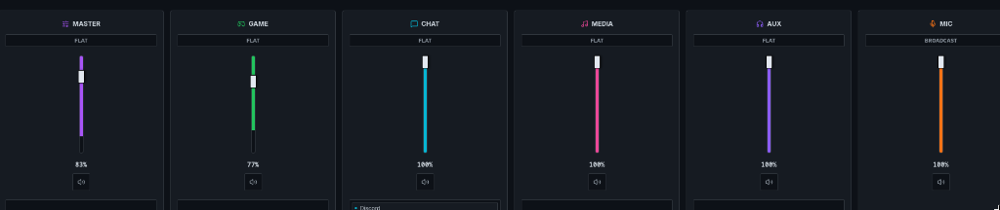
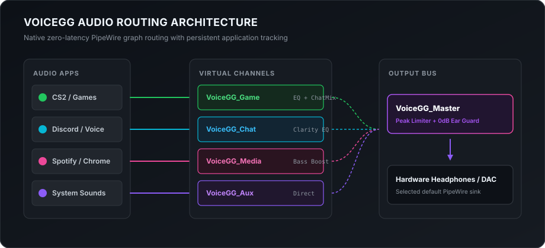
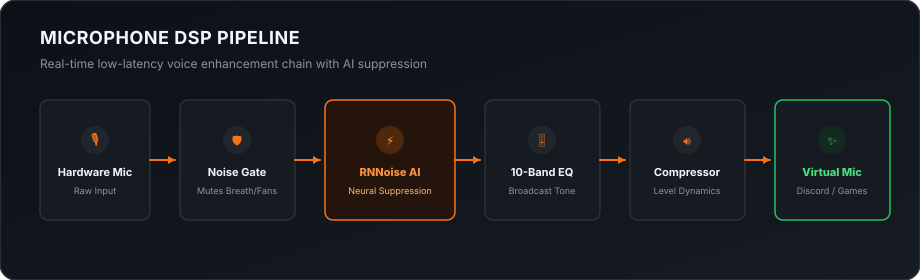

# VoiceGG steelseries gg alternative

<p align="center">
  
</p>

<p align="center">
  <b>A lightweight, zero-latency gaming audio router and mixer for Arch Linux, Hyprland, and PipeWire.</b>
  <br />
  <i>Built with Rust. Fast, private, and designed from scratch for the Linux desktop.</i>
</p>

<p align="center">
  <a href="https://github.com/1MEshh/voiceGG/actions/workflows/ci.yml"></a>
  
  
  
  
</p>

---

## The Story Behind VoiceGG

When I switched to Linux as my daily gaming driver, there was one major hurdle that almost drove me back to Windows: **audio routing**.

On Windows, I relied heavily on SteelSeries Sonar. Having dedicated channels for **Game**, **Chat**, and **Media**, separate volume controls for Discord and CS2, and a physical/software ChatMix knob was something I couldn't live without. But when I searched for an alternative on Linux, I couldn't find anything that matched:
- Generic patchbays were cluttered with hundreds of wires and had steep learning curves.
- Other solutions were heavy, bloated, or would break system defaults every time a Bluetooth headset reconnected.
- There was no sleek, gamer-friendly app that just worked on Hyprland with zero fuss.

So I decided to build my own.

I chose **Rust** because audio needs to be real-time, rock solid, and lightweight. While Windows gaming audio software often eats 400MB to 1GB of RAM and runs dozens of telemetry background services, the VoiceGG daemon sits at just **~6 MB of RAM** and uses **0.0% CPU** at idle. It runs natively in your PipeWire graph with zero artificial latency, and never sends a single byte of telemetry anywhere.

— Built with passion by [@1MEshh](https://github.com/1MEshh)

---

## Interface

<p align="center">
  
</p>

---

## Audio Architecture

VoiceGG creates 5 dedicated virtual channels directly inside the native PipeWire graph. Applications automatically route into their designated channel, and the Master bus sends the processed mix straight to your headphones with safety limiter guards.

<p align="center">
  
</p>

---

## Feature Matrix

| Feature | Status | Details |
|---|---|---|
| **PipeWire Native Graph** | ✅ Working | Direct PipeWire integration with zero-latency audio routing. |
| **5 Virtual Channels** | ✅ Working | Master, Game, Chat, Media, and Aux with individual volume and mute controls. |
| **Drag & Drop App Routing** | ✅ Working | Drag applications (Chrome, Discord, Steam) between channels with instant effect. |
| **ChatMix Balance** | ✅ Working | Dynamic balance between gaming audio and voice comms (-100 to +100). |
| **Hardware Device Selection** | ✅ Working | Live switching between headphones, DACs, and microphones. |
| **System Tray & Waybar** | ✅ Working | Closing the window minimizes to tray; full teardown on explicit Quit. |
| **Rofi / Wofi Integration** | ✅ Working | Packaged with compliant `.desktop` entry and vector icon caches. |
| **CLI & Hotkey Control** | ✅ Working | Full command-line interface for Hyprland / Sway keybinding integration. |
| **Safe Panic Reset** | ✅ Working | Instant restoration to system default audio at any time (`voicegg panic`). |
| **10-Band EQ & Mic DSP** | 🚧 In Progress | UI controls & DSP filters built; PipeWire filter-chain node wiring under active work. |

---

## Microphone DSP Pipeline

*(Under active development for seamless PipeWire filter-chain integration)*

<p align="center">
  
</p>

---

## Performance & Resource Footprint

Tested on Arch Linux with Linux 6.13 / PipeWire 1.2:

| Metric | VoiceGG Daemon | Traditional Windows Gaming Suites |
|---|---|---|
| **Idle Memory (RSS)** | **~6.1 MB** | ~450 MB – 1.1 GB |
| **Idle CPU Usage** | **0.0%** | 1.5% – 5.0% |
| **Binary Size** | **3.7 MB** | 300+ MB installer |
| **Startup Time** | **< 15 ms** | 4 – 10 seconds |
| **Telemetry / Tracking** | **Zero (0)** | Frequent cloud pings |

---

## Installation

### One-line Terminal Install (Arch Linux / Hyprland)

```bash
curl -fsSL https://raw.githubusercontent.com/1MEshh/voiceGG/main/install.sh | bash
```

The installer will:
1. Check for required build dependencies (`rust`, `nodejs`, `pipewire`, `webkit2gtk-4.1`). If any are missing, it asks you first before invoking `pacman`.
2. Build the optimized release binaries locally.
3. Install them rootlessly to `~/.local/bin` and set up the desktop launcher and icon.
4. Record an install manifest for clean, safe removal.

### Build Manually from Source

```bash
# Clone the repository
git clone https://github.com/1MEshh/voiceGG.git
cd voiceGG

# Run the installer script
./install.sh
```

---

## Hyprland Hotkey Configuration

You can bind VoiceGG commands directly to your keyboard or macro keys in `~/.config/hypr/hyprland.conf`:

```ini
# Toggle Microphone Mute
bind = SUPER, F9, exec, voicegg ctl mute mic toggle

# Adjust ChatMix balance (More Game / More Chat)
bind = SUPER, F10, exec, voicegg ctl chatmix -10
bind = SUPER, F11, exec, voicegg ctl chatmix +10

# Master Volume controls
bind = SUPER, F12, exec, voicegg ctl volume master +5
bind = SUPER SHIFT, F12, exec, voicegg ctl volume master -5

# Emergency audio reset
bind = SUPER CTRL, ESCAPE, exec, voicegg panic
```

---

## Emergency Audio Reset (Panic Button)

If an audio driver glitches or you want to instantly remove all virtual devices and restore raw hardware routing:

```bash
voicegg panic
```

Or click the yellow warning triangle in the top right corner of the VoiceGG GUI.

---

## Safe Uninstallation

To cleanly remove VoiceGG and restore all default system audio:

```bash
voicegg-uninstall
```

Or via curl:

```bash
curl -fsSL https://raw.githubusercontent.com/1MEshh/voiceGG/main/uninstall.sh | bash
```

The uninstaller:
- Restores PipeWire audio to default settings.
- Safely removes only the installed files recorded during installation.
- Asks whether you'd like to preserve or delete your presets in `~/.config/voicegg`.
- Refreshes your system desktop and icon databases.

---

## Contributing

Contributions, bug reports, and game preset requests are welcome! Please check [CONTRIBUTING.md](CONTRIBUTING.md) and [SECURITY.md](SECURITY.md) before submitting a pull request.

---

## License

VoiceGG is free and open-source software distributed under the [GNU General Public License v3.0](LICENSE).
