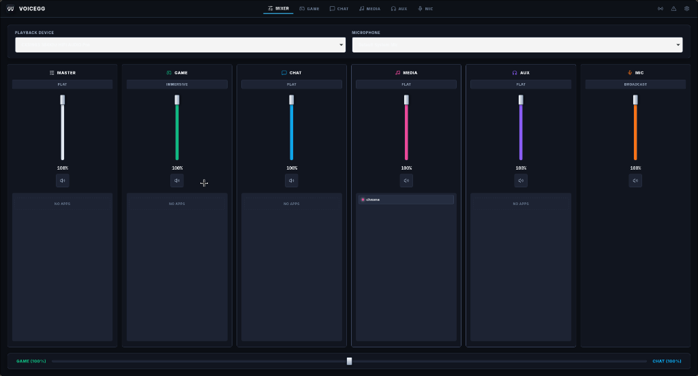
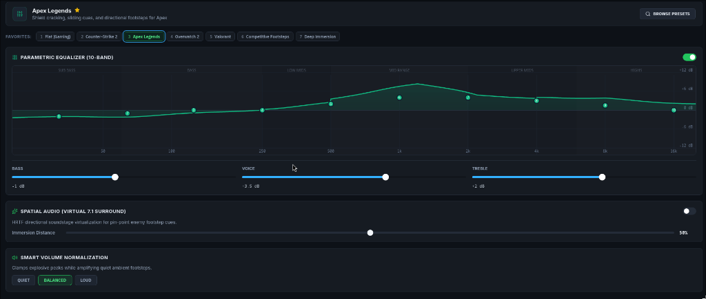
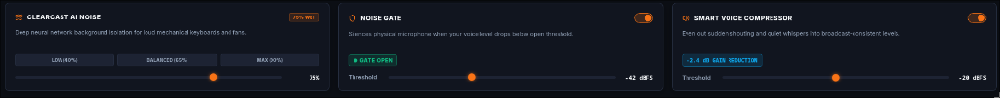

# VoiceGG — The SteelSeries Sonar & SteelSeries GG Alternative for Linux

<p align="center">
  
</p>

<p align="center">
  <b>The lightweight, zero-latency gaming audio router, 10-band parametric equalizer, and ChatMix controller for Linux & PipeWire.</b>
  <br />
  <i>The authentic SteelSeries Sonar alternative built natively for Arch Linux, Hyprland, Sway, KDE, and GNOME.</i>
</p>

<p align="center">
  <a href="https://github.com/1MEshh/voiceGG"></a>
  <a href="https://github.com/1MEshh/voiceGG/actions/workflows/ci.yml"></a>
  
  
  
  
</p>

---

## Quick Install (Arch Linux / Any Distro with PipeWire)

Run this single command in your terminal to build and install VoiceGG rootlessly to `~/.local/bin`:

```bash
curl -fsSL https://raw.githubusercontent.com/1MEshh/voiceGG/main/install.sh | bash
```

> [!TIP]
> Launch anytime from your application runner (**Rofi**, **Wofi**, **dmenu**) or run `voicegg-launcher` in terminal.

---

## Why VoiceGG? (The SteelSeries Sonar Linux Story)

When I made the full switch from Windows to Linux for gaming, there was one piece of software I couldn't live without: **SteelSeries Sonar / SteelSeries GG**.

Having dedicated virtual audio channels for **Game**, **Chat**, and **Media**, separate volume controls for Discord and Counter-Strike, a hardware/software **ChatMix** slider to instantly quiet noisy teammates in clutch moments, and a **10-band parametric EQ** tuned for enemy footsteps was essential for competitive gaming.

On Linux, there was no real equivalent:
- ❌ **Traditional patchbays (qpwgraph, Helvum)** were cluttered with spiderwebs of hundreds of audio wires, had zero gamer presets, and lacked ChatMix.
- ❌ **Windows SteelSeries GG** cannot run natively on Linux, demands Windows kernel audio drivers, consumes **~800 MB to 1.2 GB of RAM**, and runs background telemetry tracking services.
- ❌ Generic sound settings lacked application routing persistence and had no Wayland / Hyprland integration.

**VoiceGG fixes this permanently.** Written from scratch in **Rust** directly on top of the native **PipeWire** audio graph, VoiceGG gives Linux gamers the full SteelSeries Sonar experience with **6 MB of RAM**, **0.0% idle CPU**, and zero artificial latency.

— Built with passion by [@1MEshh](https://github.com/1MEshh)

---

## Interface Showcase

### 1. Multi-Channel Mixer & ChatMix
Dedicated virtual channels for **Master**, **Game**, **Chat**, **Media**, **Aux**, and **Mic**. Drag and drop running applications (Spotify, Chrome, Discord, Steam) directly between channels with instant effect. Includes a real-time **ChatMix** balance slider.

<p align="center">
  
</p>

---

### 2. 10-Band Parametric Equalizer & Game Profiles
Interactive, responsive parametric EQ graph with draggable frequency nodes. Includes built-in competitive profiles for **Apex Legends**, **Counter-Strike 2**, **Valorant**, and **Overwatch 2**, quick Bass/Vocal Clarity sliders, and **Spatial Audio (Virtual 7.1 Surround)** virtualization.

<p align="center">
  
</p>

---

### 3. Microphone DSP Suite & ClearCast AI
Studio-grade microphone processing suite featuring:
- **ClearCast AI Noise Cancellation**: Neural network background removal that silences mechanical keyboards and fan noise.
- **Noise Gate**: Instant threshold gating (`● GATE OPEN` visual status) to mute ambient room reflections.
- **Smart Voice Compressor**: Broadcast-grade dynamic compression with active gain reduction monitoring.
- **Mic Test Loopback**: Real-time 5-second countdown recording to hear your tuned voice before joining Discord.

<p align="center">
  
</p>

---

## Head-to-Head Comparison

| Feature | VoiceGG (Linux) | SteelSeries GG / Sonar (Windows) | Generic Linux Patchbays |
|:---|:---:|:---:|:---:|
| **Operating System** | **Linux (Arch, Hyprland, Sway, KDE, GNOME)** | Windows 10/11 only | Linux |
| **Idle Memory Footprint** | **~6.1 MB RSS** | ~650 MB – 1.2 GB | ~80 MB – 250 MB |
| **Idle CPU Utilization** | **0.0%** | 1.5% – 5.0% | 0.5% – 2.0% |
| **Telemetry & Tracking** | **Zero (0%) — 100% Offline & Private** | Constant cloud telemetry | None |
| **Dedicated Channels** | **5 (Master, Game, Chat, Media, Aux, Mic)** | 5 channels | Manual wire patching |
| **Drag & Drop App Routing** | **Yes (Automatic & Persistent)** | Yes | No (Manual wire links) |
| **ChatMix Balance** | **Yes (Hotkeys, GUI & Waybar module)** | Yes (SteelSeries hardware or GUI) | No |
| **10-Band Parametric EQ** | **Yes (Interactive Canvas + Presets)** | Yes | Requires third-party plugins |
| **ClearCast AI Noise Suppression** | **Yes (Integrated RNNoise)** | Yes (Cloud/Local proprietary) | Requires EasyEffects setup |
| **Waybar Status Bar Integration** | **Yes (Official Custom Module)** | N/A | No |
| **Emergency Audio Reset (Panic)** | **Yes (1-click restore to hardware defaults)** | Reinstall driver | Restart pipewire |

---

## System Tray & Waybar Integration

VoiceGG runs unobtrusively in your desktop environment. Closing the main window minimizes to the system tray, keeping your audio routed seamlessly in the background.

### Waybar Status Bar Module
VoiceGG includes an official status query script and ready-to-use custom module for Waybar users:

1. **Install helper script**:
```bash
cp packaging/waybar/waybar-voicegg.sh ~/.local/bin/
chmod +x ~/.local/bin/waybar-voicegg.sh
```

2. **Add custom module to `~/.config/waybar/config.jsonc`**:
```jsonc
"custom/voicegg": {
    "format": "{}",
    "exec": "$HOME/.local/bin/waybar-voicegg.sh",
    "return-type": "json",
    "interval": 2,
    "on-click": "voicegg-launcher",
    "on-click-middle": "voicegg ctl mute master toggle",
    "on-click-right": "voicegg ctl mute mic toggle",
    "tooltip": true
}
```

3. **Style in `~/.config/waybar/style.css`**:
```css
#custom-voicegg {
    padding: 0 10px;
    margin: 3px 4px;
    background: #11151F;
    border: 1px solid #262E40;
    border-radius: 6px;
    color: #10B981;
    font-weight: 700;
}
#custom-voicegg.offline {
    color: #64748B;
    border-color: #1C2230;
}
```

---

## Hyprland & Sway Hotkeys

Bind VoiceGG commands directly to your keyboard or macro keys in `~/.config/hypr/hyprland.conf`:

```ini
# Toggle Microphone Mute
bind = SUPER, F9, exec, voicegg ctl mute mic toggle

# Adjust ChatMix balance (More Game / More Chat Comms)
bind = SUPER, F10, exec, voicegg ctl chatmix -10
bind = SUPER, F11, exec, voicegg ctl chatmix +10

# Master Volume Controls
bind = SUPER, F12, exec, voicegg ctl volume master +5
bind = SUPER SHIFT, F12, exec, voicegg ctl volume master -5

# Emergency audio reset (Instantly restore hardware routing)
bind = SUPER CTRL, ESCAPE, exec, voicegg panic
```

---

## Audio Pipeline Architecture

VoiceGG creates virtual sink and source nodes directly in the PipeWire graph. Applications connect into their respective virtual bus, processed through low-overhead DSP filters, and summed cleanly into your physical playback device with safety limiter protection.

<p align="center">
  
</p>

---

## Frequently Asked Questions (FAQ)

### Does ChatMix require a SteelSeries headset?
**No.** VoiceGG works with **any** headset, headphone, USB DAC, or audio interface (HyperX, Logitech, Sennheiser, Beyerdynamic, Corsair, Razer, Apple EarPods, etc.). ChatMix operates directly inside the PipeWire audio engine.

### Which Linux distributions are supported?
VoiceGG is officially developed and packaged for **Arch Linux** and Arch-based distributions (EndeavourOS, Manjaro, Garuda, CachyOS), and runs on any Linux distribution with a modern **PipeWire** audio server (Fedora, Ubuntu 24.04+, Debian 13+, openSUSE).

### How do I cleanly uninstall?
VoiceGG includes a rootless, safe uninstallation script:
```bash
voicegg-uninstall
```
Or via curl:
```bash
curl -fsSL https://raw.githubusercontent.com/1MEshh/voiceGG/main/uninstall.sh | bash
```

---

## Contributing & License

VoiceGG is free, open source software licensed under the **GNU General Public License v3.0 (GPLv3)**. Pull requests, bug reports, and game preset contributions are always welcome!

- **GitHub Repository**: [https://github.com/1MEshh/voiceGG](https://github.com/1MEshh/voiceGG)
- **Author**: [@1MEshh](https://github.com/1MEshh)
